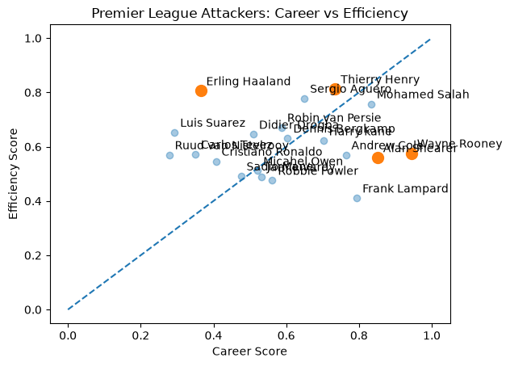
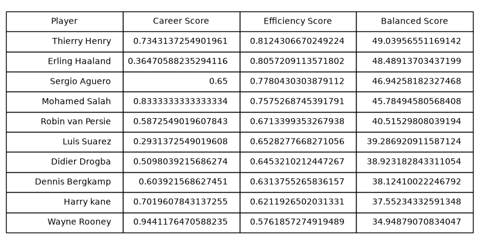

# Premier League Attacking Analysis

## Project Question

Who are the greatest Premier League attackers when balancing career production and attacking efficiency?

## Overview

This project creates a scoring model to compare Premier League attackers using both career totals and efficiency statistics.

The analysis considers:
- Non-penalty goals
- Assists
- Goal contributions
- Goals per 90
- Assists per 90
- Goal contributions per 90

## Models Created

### Career Score
Measures long-term production and career accomplishments.

### Efficiency Score
Measures attacking output relative to playing time.

### Balanced Score
Combines career value and efficiency to identify the most complete attackers.

## Results

The balanced model ranked Thierry Henry as the highest overall attacker, with Erling Haaland, Sergio Agüero, and Mohamed Salah also ranking highly.

## Visualizations

### Career vs Efficiency

### Player Rankings

